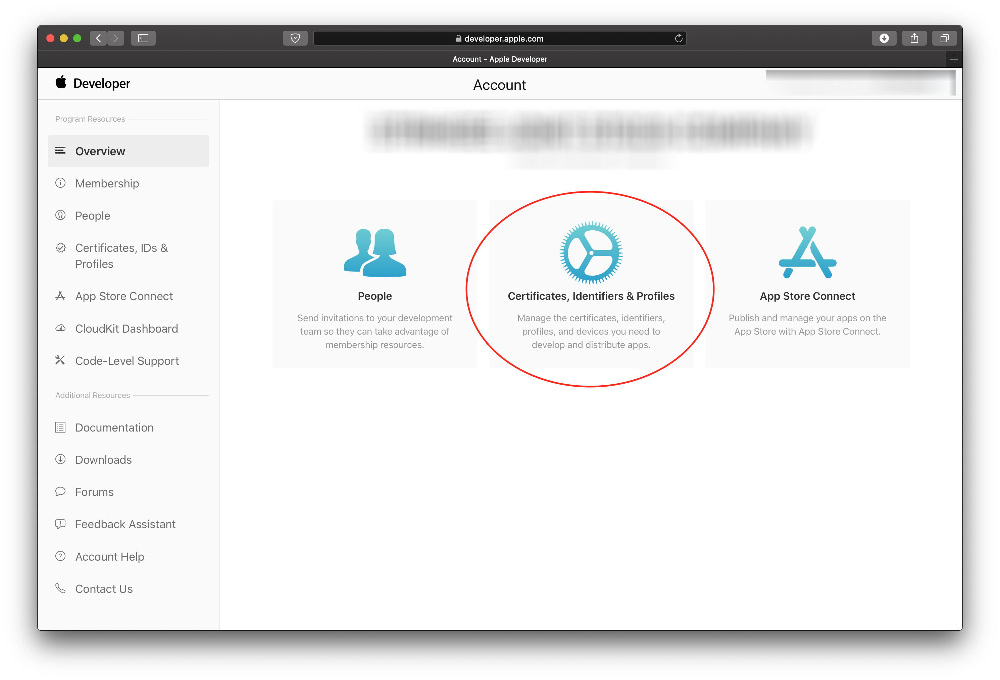
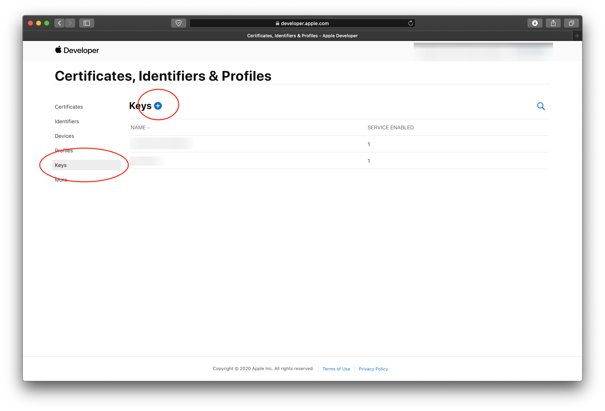
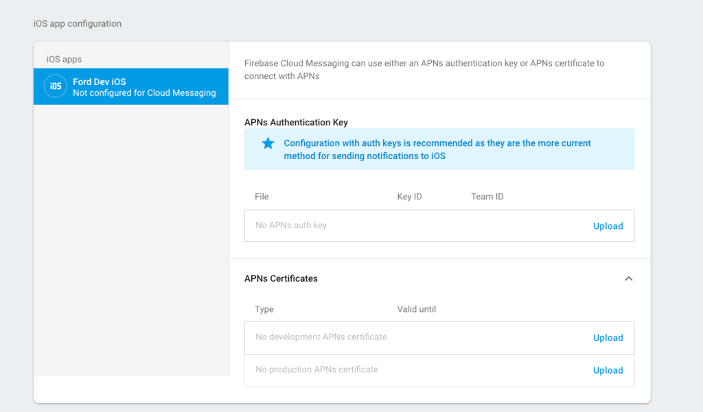
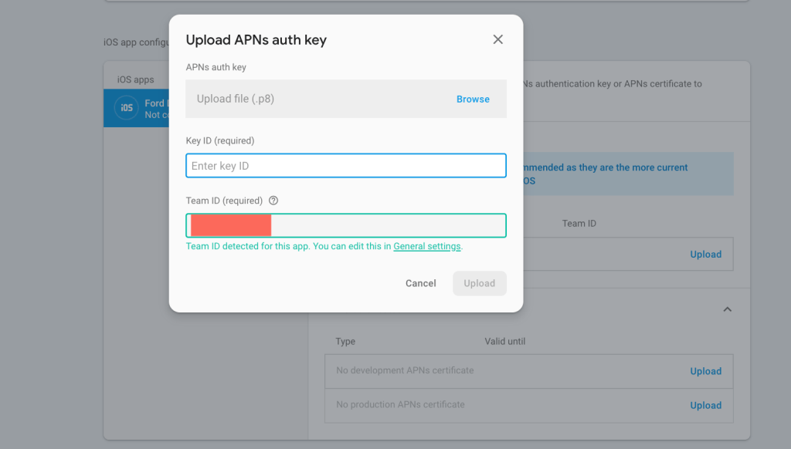
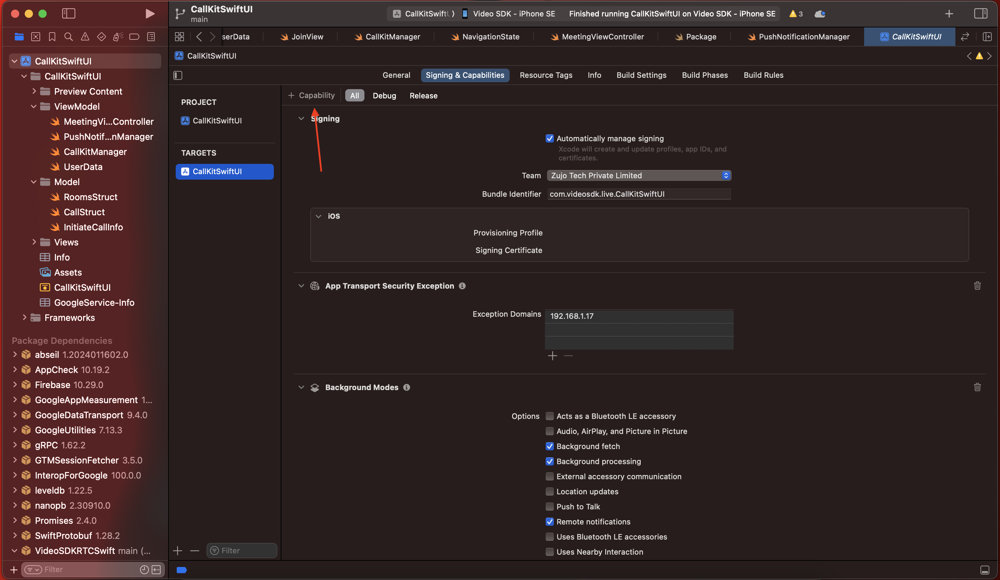
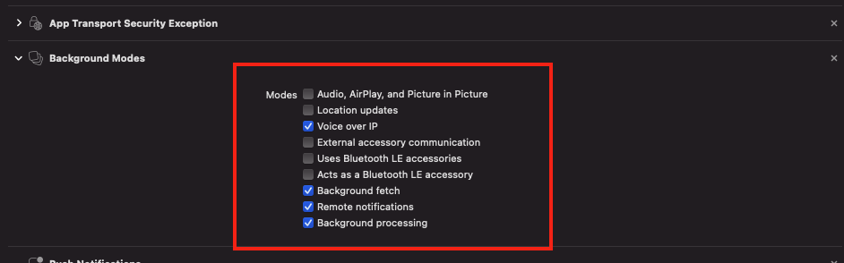

# Flutter Call Trigger with VideoSDK

## Step 1: Firebase Setup

1. Go to the [Firebase Console](https://console.firebase.google.com/).
2. Create a new project if you don't have one already. Once your project is created, navigate to the "Add app" section.
3. Choose the Flutter option to proceed.
4. Use npm to globally install the Firebase CLI. Run the following command in your terminal:

   ```bash
   npm install -g firebase-tools
   ```

5. Log in to your Firebase account using the Firebase CLI by running:

   ```bash
   firebase login
   ```



## Step 2: iOS Side Setup

### CallKit and PushKit Setup

- CallKit enables you to display the system-calling UI for your app's VoIP services and manage communication between your app, the system, and other apps. [See more details](https://developer.apple.com/documentation/callkit).
- PushKit sends notifications, including VoIP invitations. It is essential for VoIP apps. Visit [PushKit](https://developer.apple.com/documentation/pushkit) for additional details.

### Configure PushKit

1. You must upload an APNs Auth Key in order to implement push notifications. To send push notifications via an APNs Auth Key, you need:
   - Auth Key file
   - Team ID
   - Key ID
   - Your app’s bundle ID

2. To create an APNs Auth Key:
   - Visit the Apple [Developer Member Center](https://developer.apple.com/account/).
   - Click on **Certificates, Identifiers & Profiles**.
   - Go to **Keys** from the left side. Create a new Auth Key by clicking on the plus button in the top right corner.

   

3. Add a Key Name and select **APNs**.
4. Click the **Register** button.
5. Download your auth key file and upload this file to the Firebase dashboard without changing its name.

6. In your Firebase project, go to `Settings` and select the `Cloud Messaging` tab. Scroll down to `iOS app configuration` and click **Upload** under `APNs Authentication Key`.

   

7. Enter the Key ID and Team ID:
   - The Key ID is in the file name: `AuthKey_{Key ID}.p8` (10 characters).
   - The Team ID is under your account name in the Apple Member Center under the [membership tab](https://developer.apple.com/account/#/membership).

   

8. Enable **Push Notifications** in Capabilities.

   

9. Enable selected permissions in **Background Modes**.

   

## Step 3: Android Side Setup

### Modify `AndroidManifest.xml`

1. Add the required permissions:

   ```xml
   <uses-permission android:name="android.permission.INTERNET" />
   <uses-permission android:name="android.permission.RECEIVE_BOOT_COMPLETED" />
   ```

2. Inside the `<application>` tag, add the Firebase Messaging service:

   ```xml
   <service
       android:name="com.google.firebase.messaging.FirebaseMessagingService"
       android:exported="true">
       <intent-filter>
           <action android:name="com.google.firebase.MESSAGING_EVENT" />
       </intent-filter>
   </service>
   ```

## Step 4: Server Setup

### Steps to Set Up Server

1. **Create a new project directory:**
   ```bash
   mkdir server
   cd server
   npm init -y
   ```

2. **Install required dependencies:**
   ```bash
   npm install express cors morgan firebase-admin uuid
   ```
3.  **Setup Firebase Admin SDK for managing FCM**

Download private Key from firebase and add the `.json` file in the server folder.


4.  **Configure Firebase Admin in Server Code**

```js
// Path to your service account key file for Firebase Admin SDK
var serviceAccount = require("add_path_here");
```
